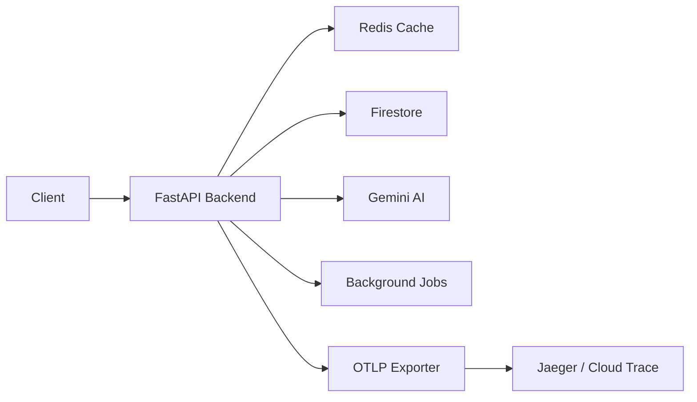

# BrandGuard Observability

OpenTelemetry-based observability for distributed tracing, metrics, and structured logging.

## Architecture



## What's Instrumented

### Traces

| Component | Span Name | Attributes |
|-----------|-----------|------------|
| HTTP Requests | Auto-instrumented | `http.method`, `http.route`, `http.status_code`, `http.request_id` |
| Cache Operations | `cache.check`, `cache.set` | `audio_id`, `cache.hit`, `cache.latency_ms` |
| Gemini AI | `gemini.analyze`, `gemini.generate_content` | `audio_id`, `model`, `duration_ms`, `result.brand_safety_score` |
| GCS Upload | `gcs.upload` | `audio_id`, `gcs_uri` |
| Firestore | `firestore.check_override`, `firestore.create_override` | `audio_id`, `override.found` |
| Background Jobs | `job.process_url` | `job_id`, `audio_id`, `job.status`, `job.duration_ms` |

### Metrics

| Metric | Type | Labels |
|--------|------|--------|
| `http.requests.total` | Counter | `method`, `endpoint`, `status` |
| `http.request.duration` | Histogram | `method`, `endpoint` |
| `cache.hits.total` | Counter | `audio_id` |
| `cache.misses.total` | Counter | `audio_id` |
| `gemini.api.duration` | Histogram | `model`, `audio_id` |
| `gemini.api.errors.total` | Counter | `audio_id`, `error_type` |
| `jobs.processed.total` | Counter | `status`, `job_id` |

### Logging

All logs are automatically enriched with trace context:
- `trace_id` - Unique trace identifier
- `span_id` - Current span identifier  
- `request_id` - HTTP request correlation ID

## Running Locally

### 1. Start the Stack

```bash
cd /path/to/BrandGuard
docker-compose up -d
```

### 2. Verify Services

```bash
docker-compose ps
```

Expected output:
```
NAME                  STATUS              PORTS
brandguard-backend    running (healthy)   0.0.0.0:8000->8000/tcp
brandguard-redis      running (healthy)   0.0.0.0:6379->6379/tcp  
brandguard-jaeger     running (healthy)   0.0.0.0:16686->16686/tcp
brandguard-frontend   running             0.0.0.0:3000->3000/tcp
```

### 3. Open Jaeger UI

Navigate to: **http://localhost:16686**

## Viewing Traces

### Find Traces

1. Open Jaeger UI at http://localhost:16686
2. Select **Service** = `brandguard-backend`
3. Click **Find Traces**

### Example Trace Flow

A typical verification request shows this span hierarchy:

```
HTTP POST /api/v1/verify_audio_url
├── firestore.check_override (2ms)
├── cache.check (1ms)
└── gemini.analyze (8500ms)
    ├── gcs.upload (450ms)
    └── gemini.generate_content (8000ms)
```

### Filter by Operation

- Use the "Operation" dropdown to filter by specific spans
- Search by trace ID using the search bar

## Configuration

### Environment Variables

| Variable | Default | Description |
|----------|---------|-------------|
| `OTEL_ENABLED` | `true` | Enable/disable telemetry |
| `OTEL_SERVICE_NAME` | `brandguard-backend` | Service name in traces |
| `OTEL_SERVICE_VERSION` | `1.0.0` | Service version |
| `OTEL_ENVIRONMENT` | `development` | Environment tag |
| `OTEL_EXPORTER_ENDPOINT` | `http://jaeger:4317` | OTLP gRPC endpoint |

### Disabling Telemetry

Set `OTEL_ENABLED=false` in your environment or `.env` file.

## Production Deployment (GCP)

### Option 1: Cloud Trace (Recommended)

Use the OpenTelemetry Collector with Cloud Trace exporter:

```yaml
# otel-collector-config.yaml
receivers:
  otlp:
    protocols:
      grpc:
        endpoint: 0.0.0.0:4317

exporters:
  googlecloud:
    project: your-gcp-project

service:
  pipelines:
    traces:
      receivers: [otlp]
      exporters: [googlecloud]
```

Deploy the collector as a sidecar in Cloud Run or GKE.

### Option 2: Managed Jaeger

Deploy Jaeger on GKE or use a managed service like Elastic APM.

### Environment Configuration

For GCP deployment, update:

```bash
OTEL_EXPORTER_ENDPOINT=http://otel-collector:4317
OTEL_ENVIRONMENT=production
```

## Troubleshooting

### No traces appearing

1. Check backend logs for "OpenTelemetry initialization complete"
2. Verify Jaeger is healthy: `docker-compose ps jaeger`
3. Check network connectivity: `docker exec brandguard-backend ping jaeger`

### High trace volume

Health check endpoints (`/health/*`) are excluded from tracing to reduce noise.

### Missing spans

Ensure all dependent services are properly instrumented. Redis is auto-instrumented; GCP services use manual spans.
