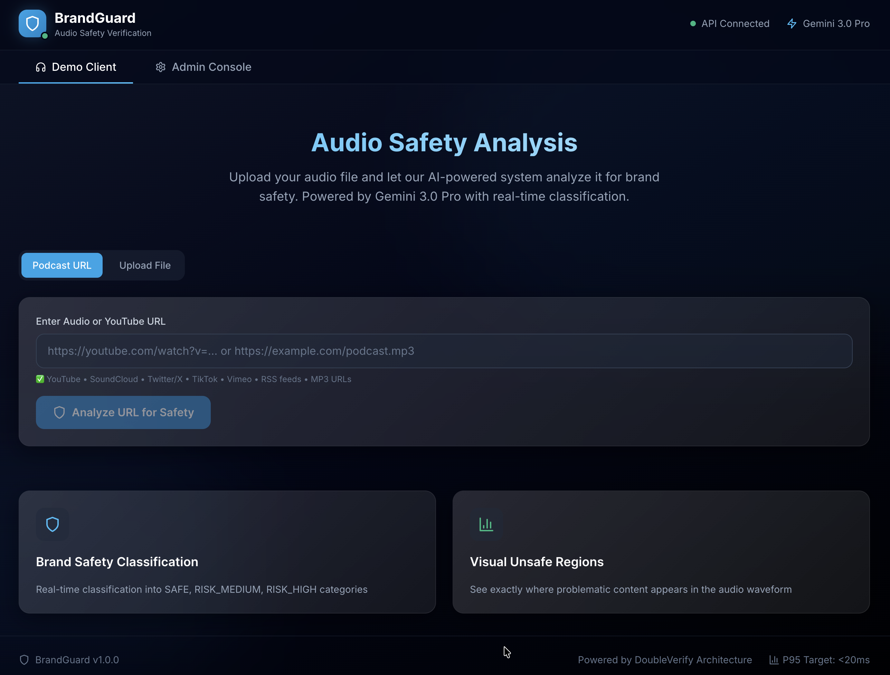

# BrandGuard - Audio Safety Verification Microservice

> **AI-powered audio content classification for brand safety in digital advertising.**  
> Built for brand safety in digital advertising.



## 🎯 Overview

BrandGuard is a production-grade microservice that analyzes audio content for brand safety classification. It uses **Google Cloud's Vertex AI (Gemini 2.0)** for intelligent content analysis and provides real-time classifications for ad-tech platforms.

### Key Features

- **AI-Powered Classification**: Gemini 2.0 Pro analyzes audio transcripts for brand safety.
- **Ultra-Low Latency**: Cache-first architecture with <5ms cached lookups.
- **Manual Overrides**: Admin console for instant classification overrides.
- **Visual Analysis**: Waveform visualization with unsafe segment highlighting.
- **Production Ready**: Docker, Cloud Run, GitHub Actions CI/CD.
- **Fully Instrumented**: OpenTelemetry tracing with Jaeger integration.

## 🏗 Architecture

```
┌─────────────────────────────────────────────────────────────────┐
│                        Client Request                            │
└─────────────────────────────────────────────────────────────────┘
                                │
                                ▼
┌─────────────────────────────────────────────────────────────────┐
│                     FastAPI Backend                              │
│  ┌──────────────┐  ┌──────────────┐  ┌──────────────────────┐  │
│  │   Override   │→ │    Cache     │→ │      AI Engine        │  │
│  │  (Firestore) │  │   (Redis)    │  │  (Gemini + STT)       │  │
│  └──────────────┘  └──────────────┘  └──────────────────────┘  │
└─────────────────────────────────────────────────────────────────┘
```

### Lookup Priority (Cache-First, AI-Fallback)

1. **Override Check** → Firestore manual overrides (highest priority)
2. **Cache Check** → Redis with 24h TTL (<5ms target)
3. **AI Analysis** → Gemini classification (fallback)

## 📁 Project Structure

```bash
BrandGuard/
├── backend/                  # FastAPI Backend
│   ├── logic/
│   │   ├── overrides.py     # Firestore override checks (ADVERIFY-UI-1)
│   │   ├── cache.py         # Redis caching (ADVERIFY-BE-1)
│   │   └── ai_engine.py     # Gemini AI classification (ADVERIFY-AI-1)
│   ├── models.py            # Pydantic data models
│   ├── config.py            # Configuration & prompts
│   ├── main.py              # FastAPI application
│   ├── worker.py            # Kafka background worker
│   ├── Dockerfile           # Production container
│   └── requirements.txt     # Python dependencies
│
├── frontend/                 # Next.js Dashboard
│   ├── app/
│   │   ├── page.tsx         # Main dashboard
│   │   ├── layout.tsx       # Root layout
│   │   └── globals.css      # Tailwind styles
│   ├── components/
│   │   ├── AudioAnalyzer.tsx    # Waveform + analysis UI
│   │   └── AdminConsole.tsx     # Override management
│   ├── Dockerfile           # Production container
│   └── package.json         # Node dependencies
│
├── .devcontainer/            # VS Code Dev Container environment
├── .mise.toml                # Project tool management & tasks
├── docker-compose.yaml      # Local infrastructure (Redis, Kafka, Jaeger)
└── .env.example             # Environment template
```

## 🚀 Development Setup

We support two primary development workflows: **Local with Mise** or **VS Code Dev Containers**. Both use `mise` to ensure tool consistency across the team.

### 1. Prerequisites
- Docker & Docker Compose
- [Mise](https://mise.jdx.dev/) installed on your host (if not using Dev Containers).
- Google Cloud Project with Vertex AI and Firestore enabled.

### 2. Initial Configuration
1. **Clone the repo:**
   ```bash
   git clone https://github.com/YOUR_ORG/brandguard.git
   cd brandguard
   ```
2. **GCP Credentials:** Place your service account JSON at:
   `./brandguard-481014-b6b02cb2d900.json/brandguard-481014-b6b02cb2d900.json`

---

### Workflow A: Dev Container (Recommended)
This is the most "isolated" way to develop. It spins up a container with Python, Node, and all CLI tools pre-installed.

1. Open the project in VS Code.
2. Click **"Reopen in Container"** when the notification appears.
3. The environment will automatically run `mise run setup` to install dependencies and start infrastructure.

### Workflow B: Local with Mise
If you prefer developing on your host machine:

1. **Install tools & dependencies:**
   ```bash
   mise install        # Installs Python 3.11/Node 20 automatically
   mise run setup      # Installs FE/BE deps and starts Redis/Kafka/Jaeger
   ```
2. **Run the full stack:**
   ```bash
   mise run dev        # Starts Backend, Worker, and Frontend in parallel
   ```

---

## 🔧 Unified Task Management (`mise`)

We use `mise` to manage common tasks across both local and container environments.

| Task | Command | Description |
| :--- | :--- | :--- |
| **Setup** | `mise run setup` | One-time setup: installs FE/BE deps and starts infra. |
| **Infra** | `mise run infra` | Starts only the Docker services (Redis, Kafka, Jaeger). |
| **Dev** | `mise run dev` | Runs all services (Backend + Frontend + Worker) in parallel. |
| **Backend** | `mise run backend` | Starts the FastAPI backend with hot-reload. |
| **Frontend** | `mise run frontend` | Starts the Next.js dev server. |
| **Down** | `mise run down` | Stops and removes all local infrastructure containers. |

---

## 📡 API Reference

### Verify Audio
`POST /api/v1/verify_audio` (multipart/form-data)

**Response:**
```json
{
  "audio_id": "audio_12345",
  "brand_safety_score": "RISK_MEDIUM",
  "fraud_flag": false,
  "category_tags": ["news", "politics"],
  "confidence_score": 0.87,
  "unsafe_segments": [{ "start": 12.5, "end": 18.3, "reason": "topic" }]
}
```

## 🔧 Configuration

| Variable | Description | Default |
| :--- | :--- | :--- |
| `GOOGLE_CLOUD_PROJECT` | GCP Project ID | required |
| `GCS_BUCKET_NAME` | Audio storage bucket | required |
| `REDIS_HOST` | Redis hostname | localhost |
| `REDIS_PORT` | Redis port | 6379 |
| `GEMINI_MODEL` | Vertex AI model | gemini-2.0-flash-001 |
| `OTEL_EXPORTER_ENDPOINT`| OTLP Trace Collector | host.docker.internal:4318 |

## 📊 Architecture Mapping

| AdDomain Story | BrandGuard Implementation |
| :--- | :--- |
| **ADVERIFY-BE-1** | `logic/cache.py` - Redis caching with <5ms target |
| **ADVERIFY-AI-1** | `logic/ai_engine.py` - Gemini classification |
| **ADVERIFY-UI-1** | `logic/overrides.py` + Admin Console |
| **ADVERIFY-BE-3** | `.github/workflows/deploy.yaml` - Cloud Run CI/CD |

## 🧪 Testing

```bash
# Backend tests
cd backend
pytest tests/ -v --cov=.

# Frontend quality checks
cd frontend
npm run lint
npm run type-check
```

## 📜 License
Proprietary - BrandGuard Project

---
Built with ❤️ using FastAPI, Next.js, and Vertex AI
